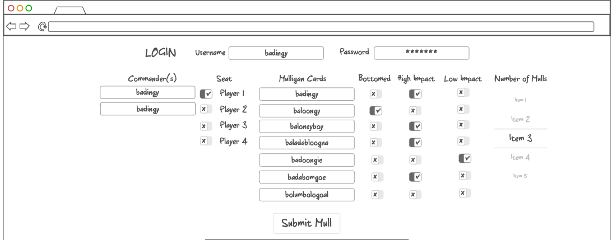

# SecondSeven

# Second Seven | The #1 Tool for cEDH Mulligans

## Elevator Pitch
Mulligan decisions have the greatest impact on your abilitiy to close out and win games of 'cEDH' (Competitive Elder Dragon Highlander). However, the effect those seven-or-so cards have on your game in the long run are difficult to visualize in the long term. Second Seven will service as your aid in not only recording those decisions, but being able to give strong visualization on the effect of your mulligan choices on your game outcomes.

## Design

## Key Features

- Secure login over HTTPS
- Ability to enter mulligan decision results, including a relative date and the result of the game
- Mulligan are shared with players who register themselves as playing the same deck as you
- Players can vote up or down on mulligan choices, showing their support of your keep
- Results, impact, the cards, etc are all stored
- Player can view their mulligan history, sorted by commander
- Admin can delete logs/scores and remove them from data pools

## Technologies

- HTML - HTML structure will be used for this application, including multiple HTML pages. Main page for current leaderboards, a history page for past matches, a profile page, etc.
- CSS - Application styling will look good and have the modern reactivity, coloring, and feel to the user experience
- JavaScript - Login, opening submission windows, allowing for manipulation of visible data
- Service - Backend endpoints for:
  - login
  - submitting mulligans
  - retrieving a list of mulligans based on commander
- DB - Store users, game logs, mulligans, commanders and more, overall card impact
- Login - Register and login users. Credentials will be stores. Can't submit mulligans unless the user is authentificated
- WebSocket - Players can look up and vote on mulligan choices. These scores are then showed to everyone.
- Application will be ported for React web framework (I am still learning what this means)